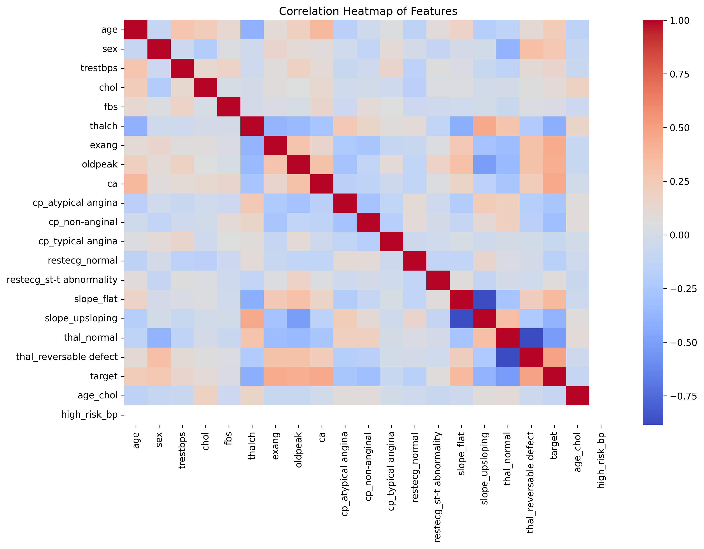
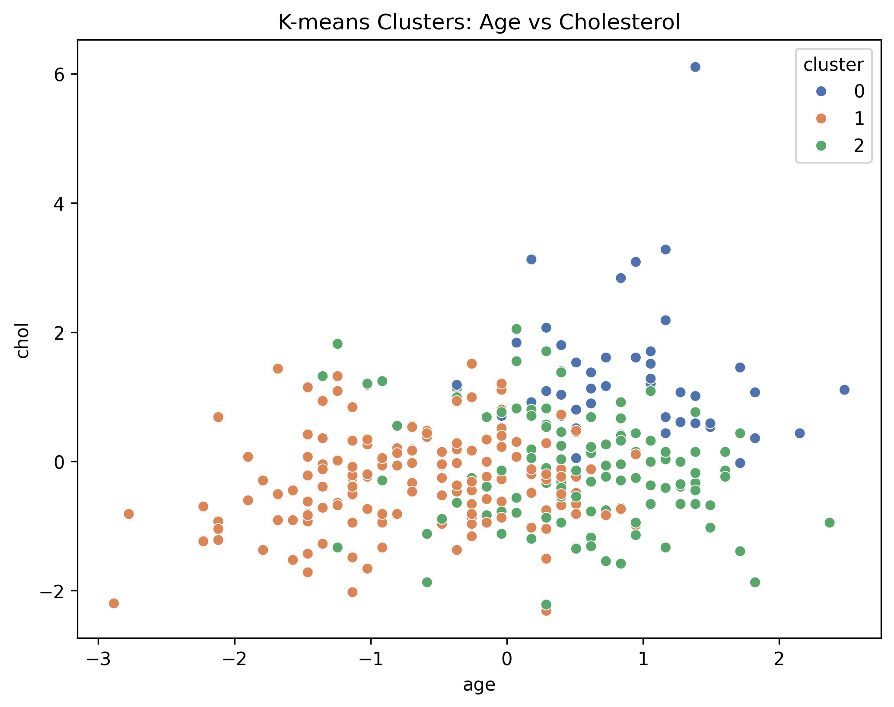
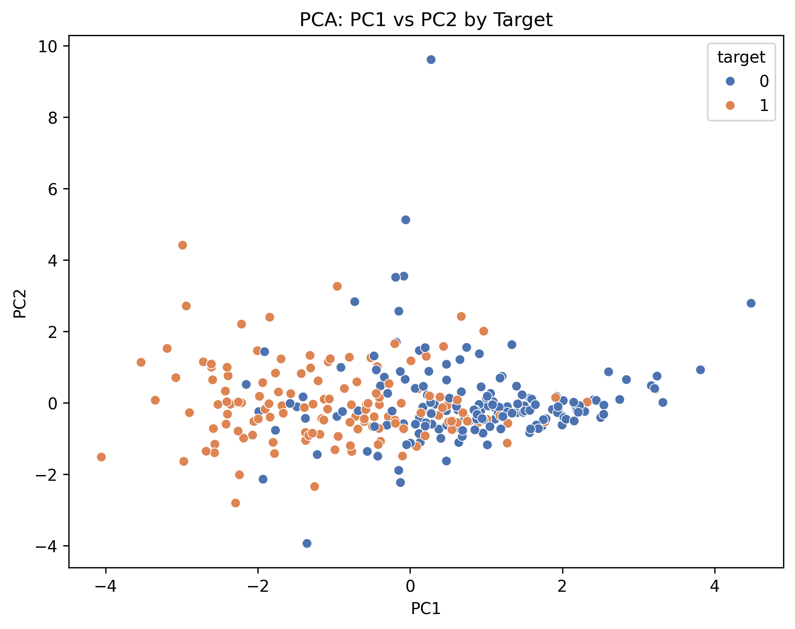
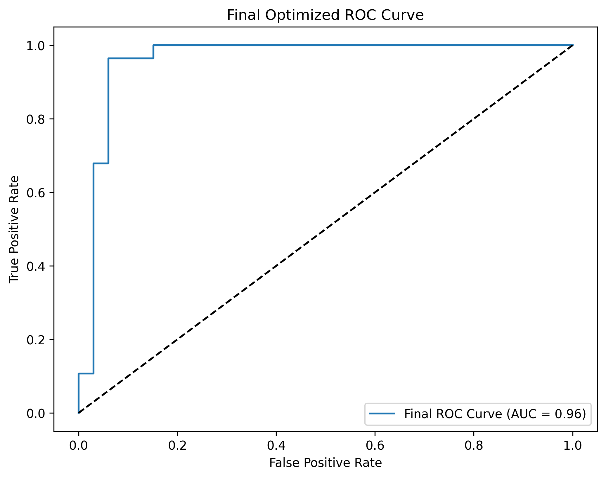
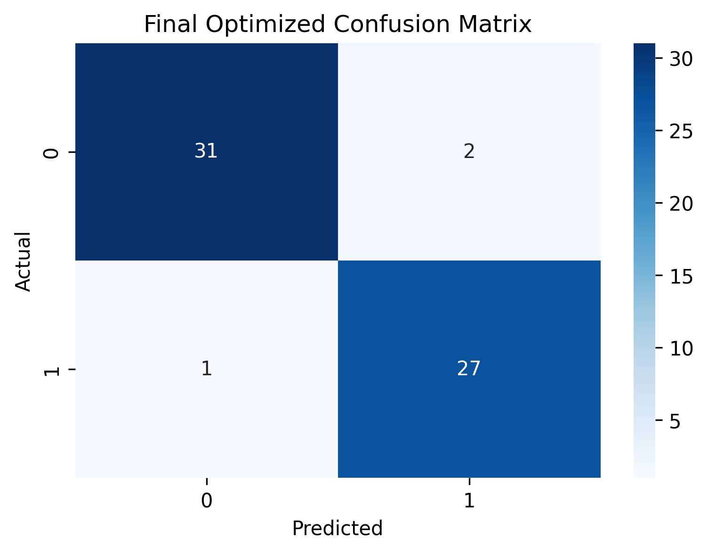

# Heart Disease ML Project

## Project Overview
This project demonstrates machine learning techniques for predicting heart disease presence using the Heart Disease UCI dataset (Cleveland subset). It includes unsupervised learning (K-means clustering, PCA) and supervised learning (Random Forest Classifier), showcasing data preprocessing, feature engineering, model optimization, and visualization.
- **Dataset**: Heart Disease UCI (Cleveland), 303 rows, 14 original features.
- **Techniques**:
  - **Data Preprocessing**: Handled missing values, encoded categorical features, scaled numerical features, and engineered new features (e.g., `age_chol`, `thalch_oldpeak`).
  - **K-means Clustering**: Identified patient groups based on health metrics.
  - **Principal Component Analysis (PCA)**: Reduced dimensionality for visualization and modeling.
  - **Random Forest Classifier**: Predicted heart disease presence with optimization via feature selection, PCA features, and hyperparameter tuning.
- **Tools**: Python, scikit-learn, pandas, matplotlib, seaborn, Jupyter Notebook.

## Key Results
- **K-means Clustering**: Identified 3 patient clusters, with distinct health profiles (e.g., high-risk vs. low-risk groups).
- **PCA**: Reduced features to 2 components for visualization, capturing ~30-40% variance, and to 12 components for modeling (95% variance).
- **Random Forest Performance**:
  - Final Accuracy: 0.95
  - ROC AUC: 0.96
  - Top Features: `thalch`, `oldpeak`, `age_chol` (indicating exercise-induced stress and cholesterol as key predictors).

## Visualizations
- **Correlation Heatmap**: Shows feature relationships.
  
- **K-means Clusters**: Age vs. Cholesterol by cluster.
  
- **PCA Scatter**: PC1 vs. PC2 by target.
  
- **Final ROC Curve**: Optimized Random Forest performance.
  
- **Final Confusion Matrix**: Classification performance.
  

## License
This project is licensed under the MIT License - see the [LICENSE](LICENSE) file for details.

## How to Run
1. Clone the repository:
   ```bash
   git clone https://github.com/GoudyMT/heart-disease-ml.git
   cd heart-disease-ml

2. Set up a virtual environment and install dependencies:
    ```bash
    .\venv\Scripts\activate  # On Windows
    pip install -r requirements.txt

3. Launch Jupyter Notebook and open notebooks/ml-portfolio.ipynb:
    ```bash
    jupyter notebook

4. Run the notebook cells to reproduce the analysis.

## Contact
- https://www.linkedin.com/in/goudymt/
